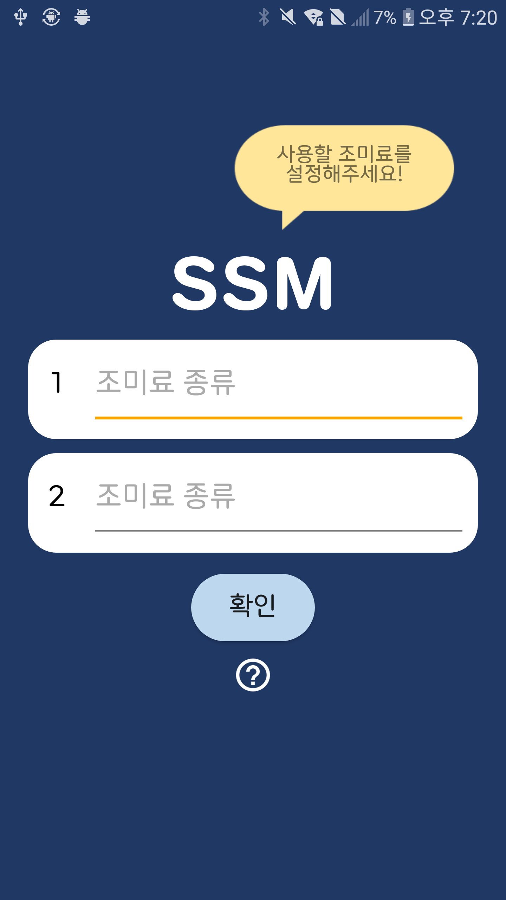

# 스마트 조미료통 [SSM]
Smart Spice Machine   
 

## 프로젝트 요약
> 2020.03. - 2020.10.   
 
> **Back-End Developer**   
* 🏅 2020 ICT 융합 프로젝트 공모전 장려상   
* 🏅 2020 교내 Deep Change 인하공대 Start-up Challenge 최우수상
* 요리 초보가 계량을 쉽게 할 수 있도록 하기 위해 기획하였습니다.
* 사용자가 자주 사용하는 레시피를 모바일 앱에 저장합니다.
* 앱에서 레시피를 실행하면 앱과 연결된 조미료통은 지정된 수치만큼 조미료를 분출합니다.

## 담당 역할
### Android
* 사용자가 입력한 레시피 서버 DB에 저장
* '레시피 실행'과 '바로 실행' 기능 구현
* 실행할 조미료를 서버에 request

### BE
  

* AWS free tier 사용
* MySQL 사용자 DB 생성
* 사용자가 실행한 조미료 데이터를 조미료통의 NodeMCU에게 json으로 전송

* * *
### 참조한 사이트
http통신 : [webnautes](https://webnautes.tistory.com/1189)    
